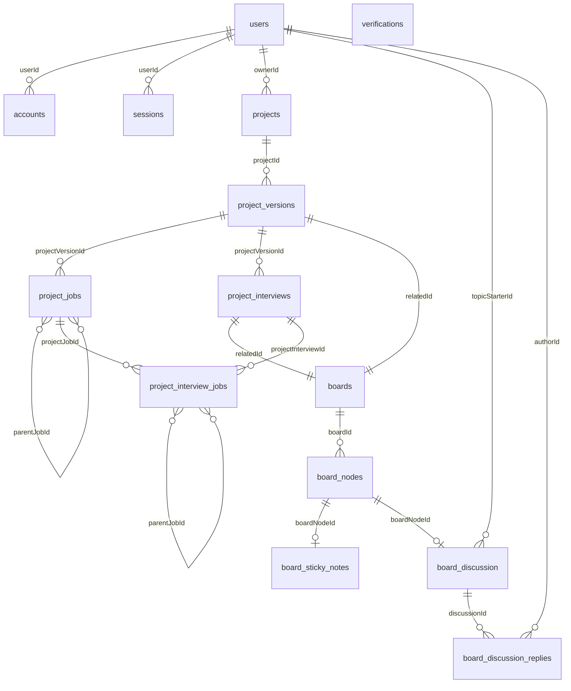

# ERD

```mermaid
erDiagram
    users ||--o{ accounts : "userId"
    users ||--o{ sessions : "userId"
    users ||--o{ projects : "ownerId"
    users ||--o{ board_discussion : "topicStarterId"
    users ||--o{ board_discussion_replies : "authorId"

    projects ||--o{ project_versions : "projectId"

    project_versions ||--o{ project_jobs : "projectVersionId"
    project_versions ||--o{ project_interviews : "projectVersionId"
    project_versions ||--|| boards : "relatedId"

    project_jobs }o--o{ project_jobs : "parentJobId"
    project_jobs ||--o{ project_interview_jobs : "projectJobId"

    project_interviews ||--|| boards : "relatedId"
    project_interviews ||--o{ project_interview_jobs : "projectInterviewId"

    project_interview_jobs }o--o{ project_interview_jobs : "parentJobId"

    boards ||--o{ board_nodes : "boardId"

    board_nodes ||--o| board_sticky_notes : "boardNodeId"
    board_nodes ||--o| board_discussion : "boardNodeId"

    board_discussion ||--o{ board_discussion_replies : "discussionId"

    verifications
```
