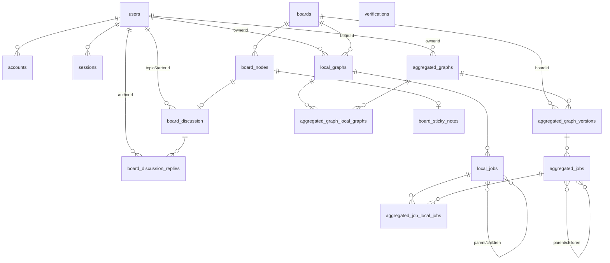

# ERD

```mermaid
erDiagram
    users ||--o{ accounts : ""
    users ||--o{ sessions : ""
    users ||--o{ local_graphs : "ownerId"
    users ||--o{ aggregated_graphs : "ownerId"
    users ||--o{ board_discussion : "topicStarterId"
    users ||--o{ board_discussion_replies : "authorId"

    boards ||--o{ local_graphs : "boardId"
    boards ||--o{ aggregated_graph_versions : "boardId"
    boards ||--o{ board_nodes : ""

    local_graphs ||--o{ local_jobs : ""
    local_graphs ||--o{ aggregated_graph_local_graphs : ""

    local_jobs }o--o{ local_jobs : "parent/children"
    local_jobs ||--o{ aggregated_job_local_jobs : ""

    aggregated_graphs ||--o{ aggregated_graph_versions : ""
    aggregated_graphs ||--o{ aggregated_graph_local_graphs : ""

    aggregated_graph_versions ||--o{ aggregated_jobs : ""

    aggregated_jobs }o--o{ aggregated_jobs : "parent/children"
    aggregated_jobs ||--o{ aggregated_job_local_jobs : ""

    board_nodes ||--o| board_sticky_notes : ""
    board_nodes ||--o| board_discussion : ""

    board_discussion ||--o{ board_discussion_replies : ""

    verifications
```
