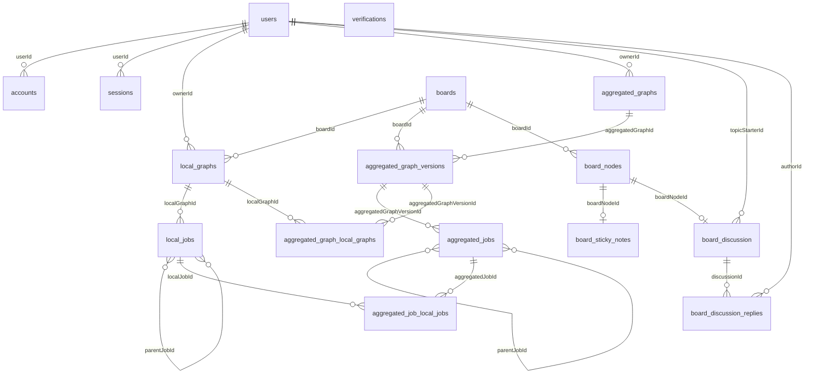

# ERD

```mermaid
erDiagram
    users ||--o{ accounts : "userId"
    users ||--o{ sessions : "userId"
    users ||--o{ local_graphs : "ownerId"
    users ||--o{ aggregated_graphs : "ownerId"
    users ||--o{ board_discussion : "topicStarterId"
    users ||--o{ board_discussion_replies : "authorId"

    boards ||--o{ local_graphs : "boardId"
    boards ||--o{ aggregated_graph_versions : "boardId"
    boards ||--o{ board_nodes : "boardId"

    local_graphs ||--o{ local_jobs : "localGraphId"
    local_graphs ||--o{ aggregated_graph_local_graphs : "localGraphId"

    local_jobs }o--o{ local_jobs : "parentJobId"
    local_jobs ||--o{ aggregated_job_local_jobs : "localJobId"

    aggregated_graphs ||--o{ aggregated_graph_versions : "aggregatedGraphId"

    aggregated_graph_versions ||--o{ aggregated_jobs : "aggregatedGraphVersionId"
    aggregated_graph_versions ||--o{ aggregated_graph_local_graphs : "aggregatedGraphVersionId"

    aggregated_jobs }o--o{ aggregated_jobs : "parentJobId"
    aggregated_jobs ||--o{ aggregated_job_local_jobs : "aggregatedJobId"

    board_nodes ||--o| board_sticky_notes : "boardNodeId"
    board_nodes ||--o| board_discussion : "boardNodeId"

    board_discussion ||--o{ board_discussion_replies : "discussionId"

    verifications
```
